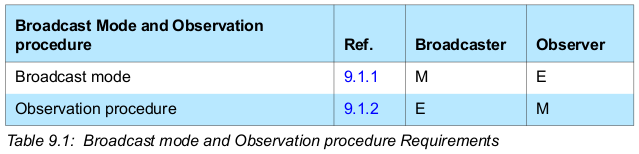

OOB途径：可以代替一般的蓝牙设备搜索和配对过程

## 4. Discovery Modes and Procedures (设备发现模式和过程)

设备发现模式和过程，是蓝牙设备搜索过程中涉及的设备需要遵循的规范行为。
在这个过程中，被搜索的设备必须处于特定的发现模式下，而执行搜索的设备必须执行特定的过程来执行搜索。


**被搜设备的模式**

被搜搜设备必须处于不可发现模式(Non-discoverable mode)或


| 模式  | Non-discoverable mode | Limited discoverable mode | General discoveralbe mode
|


1. 被搜索的设备必须处于不可发现状态(Non-discoverable mode)或一种可发现状态(Limited/General discoverable mode)
```c
      | Non-discoveralbe mode | Limited discoverable mode | General discoverable mode


```


2. 执行搜索的设备


## 9. Operational modes and procedures - LE physical transport（LE链路相关的模式和过程）

The following modes and procedures are defined for use over an LE physical transport (several different
modes and procedures may be performed simultaneously):
- Broadcast mode and observation procedure
- Discovery modes and procedures
- Connection modes and procedures
- Bonding modes and procedures

可以在一条LE链路上使用的模式和过程定义如下（其中的一些模式和过程可以同时进行）：
- 广播模式（发送无连接的advertising包）和发现过程（做BLE scanning）
- 设备可搜索模式（一般是发送可连接的advertising包）和设备搜索过程（做BLE scanning）
- 设备可连接模式（发送可连接advertising包）和设备连接过程（做BLE initiating）

The Host shall configure the Controller with its local Link Layer feature
information as defined in [Vol. 6] Part B Section 4.6 before performing any of
the above modes and procedures.

[TODO]???

### 9.1 Broadcast mode and observation procedure

The broadcast mode and observation procedure allow two devices to
communicate in a unidirectional connectionless manner using the advertising
events.

广播模式和发现过程允许两个设备通过advertising事件进行单向无连接沟通。

GAP角色应支持的单向无连接模式或过程：



\*其中E（Excluded）表示该模式或过程对当前角色不适用

**Broadcast Mode**

The broadcast mode provides a method for a device to send connectionless
data (ADV_NONCONN_IND or ADV_SCAN_IND) in advertising events.
The advertising data shall be formatted using the Advertising Data (AD) type
format.
A device in the broadcast mode shall not set the ‘LE General Discoverable Mode’
flag or the ‘LE Limited Discoverable Mode’ flag in the Flags AD Type.

Note: All data sent by a device in the broadcast mode is considered unreliable
since there is no acknowledgement from any device that may have received
the data.

**Observation Procedure**

The observation procedure provides a method for a device to receive
connectionless data from a device that is sending advertising events.
A device performing the observation procedure may use passive scanning or
active scanning (get SCAN_RSP data) to receive advertising events.

LE Privacy: When a device performing the observation procedure receives a resolvable
private address in the advertising event, the device may resolve the private address
by using the resolvable private address resolution procedure.

### 9.2 Discovery modes and procedures

All devices shall be in either non-discoverable mode or one of the discoverable
modes (general/limited discoverable mode).

GAP角色应支持的Discovery模式或过程：
```c
Modes and procedures        Peripheral
--------------------------------------
1. Non-Discoverable mode       [M]
2. Limited Discoverable mode   [O]
3. General Discoverable mode   [C] if 2. is not supported then 3. is mandatory, otherwise optional.
4. Name Discovery procedure    [O]

Modes and procedures        Central
--------------------------------------
1. Limited Discovery procedure [O]
2. General Discovery procedure [M]
3. Name Discovery procedure    [O]
```

**Non-Discoverable Mode**

A Peripheral device in the non-connectable mode may send ADV_NONCONN_IND/ADV_SCN_IND advertising packets
or may not send advertising packets.
The advertising data shall not set ‘LE General/Limited Discoverable Mode’ flag in the Flags AD type.

**Limited/General Discoverable Mode**

The limited/general discoverable mode is typically used when the device is intending to be
discoverable for a limited/long period of time.

```c
Discoveralbe Time    a limited period of time         a long period of time
                     no longer than T_GAP(lim_adv_timeout) 180s
Can be discovered by    limited or general discovery procedure  general discovery procedure
Advertising Packets       ADV_NONCONN_IND/ADV_IND/ADV_SCAN_IND/SCAN_RSP
LE Limited Discoverable Mode flag        1             0
LE General Discoveralbe Mode flag        0             1
For LE-only device:
    BR/EDR Not Supported                      1
    Simultaneous LE and BR/EDR to Same Device Capable (Controller) 0
    Simultaneous LE and BR/EDR to Same Device Capable (Host) 0
Should also include for faster connectivity experience
    TX Power Level, Local Name, Service UUIDs, Slave Connection Interval Range
Advertising Filter Policy                Process SCAN_REQ and CONNECT_REQ from all devices
The device shall remain in general discoverable mode until a connection is
established or the Host terminates the mode.
Note:
    Data that change frequently should be placed in the advertising data and
static data should be placed in the scan response data.
    The choice of advertising interval is a trade-off between power
consumption and device discovery time.
```

**Limited/General Discovery Procedure**
```c
Receive data from device       in Limited discoverable mode    in Limited and Gernal discoverable mode
Shall set Sanner_Filter_Policy                   process all advertising packets
Should set scan interval
Should set scan window
Should configure controller                      use active scanning
Should continue scan           at least T_GAP(lim_disc_scan_min) 10.24s   at least T_GAP(gen_disc_scan_min) 10.24s
Shall accept advertising data when   LE Limited Discoverable Flag is 1   LE Limited or General Discoverable Flag is 1
```
???
The host shall ignore the 'Simultaneous LE and BR/EDR to Same Device
Capable (Controller)' and 'Simultaneous LE and BR/EDR to Same Device
Capable (Host)' bits in the Flags AD type.

**Name Discovery Procedure**

If the complete device name is not acquired while performing either the limited
discovery procedure or the general discovery procedure, then the name
discovery procedure may be performed.

The name discovery procedure shall be performed as follows:
- The Host shall establish a connection using one of the connection establishment procedures
- The Host shall read the device name characteristic using the GATT procedure - Read Using Characteristic UUID
- The connection may be terminated after the GATT procedure has completed

### 9.3 Connection Modes and Procedures

When devices are connected, the parameters of the connection can be
updated with the Connection Parameter Update procedure.

GAP角色应支持的Connection模式或过程：
```c
Broadcaster和Observer这两个角色只支持Non-connectable Mode,其他连接模式和所有的连接过程都不支持。

Modes and Procedures                          Peripheral
--------------------------------------------------------
Non-connectable mode                          [M]
Undirected connectable mode                   [M]
Directed connectable mode                     [O]
Connection parameter update procedure         [O]
Terminate connection procedure                [M]

Modes and Procedures                          Central
--------------------------------------------------------
Auto connection establishment procedure       [O]
Selective connection establishment procedure  [O]
General connection establishment procedure    [C] *如果支持LE Privacy则Mandatory，否则Optional
Direct connection establishment procedure     [M]
Connection parameter update procedure         [M]
Terminate connection procedure                [M]
```

**Non-Connectable Mode**

A device in the non-connectable mode may send ADV_NONCONN_IND or ADV_SCAN_IND packets.
In this case it is recommended that the Host configures the Controller as follows:
- should set the Advertising_Filter_Policy to
  "process scan and connection requests only from devices in the White List" or
  "process scan and connection requests from all devices"
- should set the advertising interval ...

**Undirected Connectable Mode**
```c
Shall send advertising packets                        ADV_IND
Shall accept CONNECT_REQ from a device performing     Auto or General connection establishment procedure
Should config advertising interval ...
```

**Directed Connectable Mode**
This mode shall only be used if the device has a known peer device address.
```c
Shall send advertising packets                        ADV_DIRECT_IND
Shall accept CONNECT_REQ from a device performing     Auto or General connection establishment procedure
```

**Auto Connection Establishment Procedure**

This procedure uses
the initiator White List in the Controller. The Controller autonomously
establishes a connection with a device with the device address that matches
the address stored in the White List.

When a Host performs the auto connection establishment procedure, the Host
configures the Controller as follows:
1. The Host shall write the list of device addresses that are to be auto con-
nected to into the White List.
2. The Host shall set the initiator filter policy to ‘process connectable
advertising packets from all devices in the White List’.
3. The Host should set the scan interval and scan window as defined in
Section 9.3.11.
4. The Host should set connection parameters as defined in Section 9.3.12.
This procedure is terminated when a connection is established or when the
Host terminates the procedure.

**Direct Connection Establishment Procedure**

The direct connection establishment procedure allows the Host to establish a
connection with the Host selected connection configuration parameters with a
single peer device.

When a Host performs the direct connection establishment procedure, the Host
configures the Controller as follows:
1. The Host shall set the initiator filter policy to ‘ignore the White List and pro-
cess connectable advertising packets from a specific single device specified
by the Host’.
2. The Host shall set the peer address to the device address of the specific
single device.
3. The Host should set connection parameters as defined in Section 9.3.12.
4. The Host shall initiate a connection.
This procedure is terminated when a connection is established or when the
Host terminates the procedure.

**General Connection Establishment Procedure**

先做scan接收所有能收到的设备，然后选择一个设备去连接。

**Selective Connection Establishment Procedure**

使用whitelist做scan接收到设备后，选择一个设备去连接。

