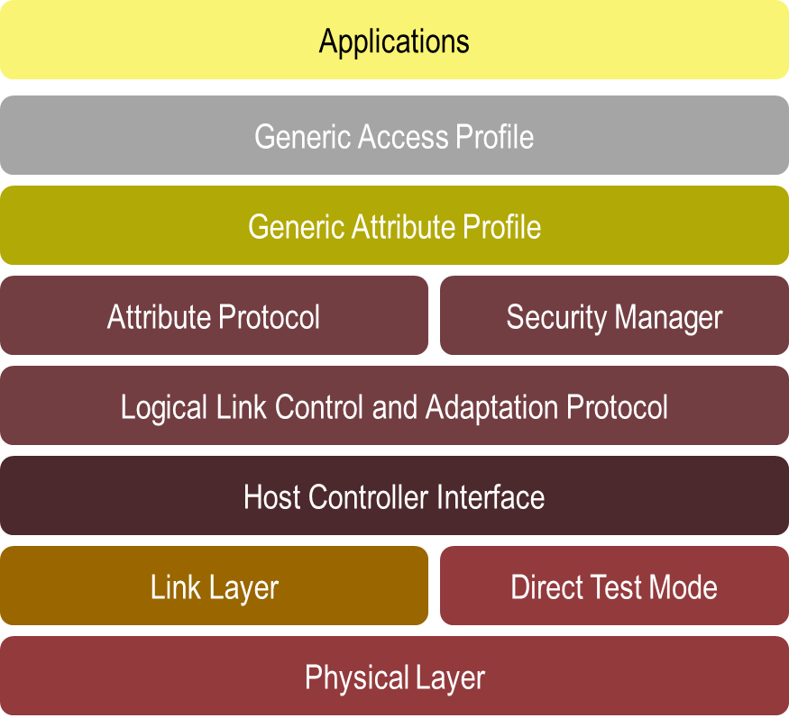
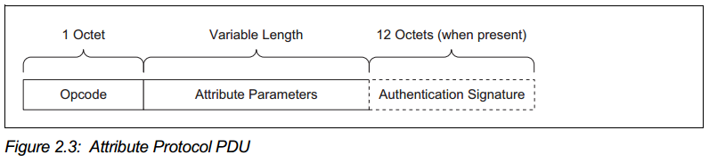
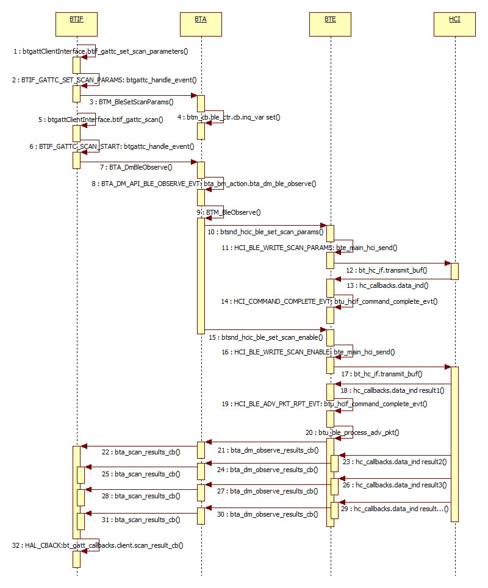

# Android低功耗蓝牙架构

## 1. 低功耗蓝牙简介

低功耗蓝牙（BLE）技术从2010年开始引入到蓝牙4.0核心规范中。
它专门面向对成本和功耗都有较高要求的无线解决方案，
可广泛用于卫生保健、体育健身、家庭娱乐、安全保障等诸多领域。
它的主要特点是：超低峰值功耗、平均功耗和待机功耗；使用标准纽扣电池可以运行一年乃至数年；
低成本；不同厂商设备易于实现交互性。

低功耗蓝牙不仅具有超低功耗优势，而且还有明显的应用开发优势。
因为它的成本更低，还提供了灵活的应用开发架构用于创建蓝牙智能传感器应用。
这允许开发人员把日常物品如心率监控器、牙刷、鞋等等都带入到互联世界中，
并与消费者已经拥有的智能手机、平板电脑、或其他智能设备上的应用APP进行沟通。
目前，这项技术已应用于每年出售的数亿台便携设备上，为开拓钟表、远程控制、
医疗保健及运动感应器等广大新兴市场的应用奠定了基础。


图1-1 低功耗蓝牙的典型应用

低功耗蓝牙引入后，Android从4.3版本（API Level 18）开始支持这项技术。
低功耗蓝牙有两种角色：核心（Central）以及外设（Peripheral）。
核心设备用于访问外设的数据和服务，
而外设则是能产生各种数据的传感器以及提供各种服务的设备。
Android 4.3只支持核心这一个角色，这个角色可以让应用搜索周围的设备、
查询它们提供的服务、获取或请求这些服务供应用使用，
这使得Android应用可以方便访问到附近的各种传感或穿戴设备的服务。
而到了5.0之后，Android开始支持外设这个角色，
应用程序利用这个角色的功能可以让附近的设备找到它、
并让附近的设备与其建立连接、访问它的数据与服务。
因此5.0之后，可以创建诸如计步器、健康监控器等功能的应用，
让附近其他设备与它进行沟通。


图1-2 低功耗蓝牙的两个角色

## 2. BLE整体架构

### 2.1 BLE Android架构

首先，Android的蓝牙协议栈（Bluetooth Stack）分成了相互隔离的两层：
最底层的蓝牙嵌入系统（Bluetooth Embedded System, BTE）层实现蓝牙规范核心功能；
上面的蓝牙应用层（Bluetooth Application Layer, BTA）则完成与Android框架的交互。

蓝牙系统服务（Bluetooth System Service）位于蓝牙协议栈之上，它们之间通过JNI进行交互。
最上层的Android应用则通过Binder进程间通信机制与蓝牙系统服务进行沟通。
如下面的Android蓝牙基本架构图。


架构中各模块具体功能如下：
- 应用框架层

    在应用框架层上的是应用代码，它们使用android.bluetooth包中提供的应用接口完成与蓝牙硬件的交互。
    在内部，这些代码通过Binder进程间通信机制完成与蓝牙服务进程的调用。
    BLE相关代码位于frameworks/base/core/java/android/bluetooth/le/文件夹中。

- 蓝牙系统服务层

    蓝牙系统服务相关实现位于packages/apps/Bluetooth/文件夹内。
    它在Android框架层实现了蓝牙相关服务及Profile，
    它被打包成为一个Android应用APP，这个APP通过JNI调用蓝牙硬件抽象层（HAL）的功能。
    其他中与BLE相关代码位于packages/apps/Bluetooth/src/com/android/bluetooth/gatt/
    以及packages/apps/Bluetooth/src/com/android/bluetooth/btservice/文件夹中。

- JNI层

    蓝牙JNI的代码位于packages/apps/Bluetooth/jni/文件夹内。
    这些JNI代码调用HAL层的功能，并接收来自于HAL层的回调。
    与BLE相关代码位于packages/apps/Bluetooth/jni/com_android_bluetooth.h以及
    packages/apps/Bluetooth/jni/com_android_bluetooth_gatt.cpp文件中。

- HAL层

    蓝牙硬件抽象层为蓝牙硬件的访问提供了标准接口。
    这些接口包含在hardward/libhardware/include/hardward/文件夹中。
    与BLE相关代码位于hardware/libhardware/include/hardware/bluetooth.h以及
    hardware/libhardware/include/hardware/bt_gatt.h文件中。

- 蓝牙协议栈层

    蓝牙协议栈代码从6.0开始位于system/bt文件夹下，而之前的版本则位于
    android/external/bluetooth/下。
    它实现了蓝牙应用层（BTA）以及蓝牙嵌入系统（BTE）的功能。
    与BLE相关的代码主要位于如下文件中：
    btif/co/bta_gattc_co.c，
    btif/co/bta_gatts_co.c，
    btif/include/btif_gatt.h，
    btif/include/btif_gatt_*.h，
    btif/src/btif_gatt.c，
    btif/src/btif_gatt_*.c，
    bta/include/bta_gatt_*.h，
    bta/src/gatt/bta_gatt_*.c，
    stack/include/gatt_api.h，
    stack/include/gattdefs.h，
    stack/include/smp_api.h，
    stack/gatt/att_protocol.c，
    stack/gatt/gatt_*.c，
    stack/smp/*.c。

### 2.2 BLE核心规范架构

低功耗蓝牙使用基于服务的架构，所有数据交互都通过GATT（Generic Attribute Profile）来完成。
GATT建立在ATT协议（Attribute Protocol）和SMP协议（Security Manager Protocol）之上，
它定义了如何将应用或Profile提供的各种服务发布到外部、以及如何响应其他低功耗蓝牙设备的服务请求，
它还定义了如何搜索附近的服务、以及如何访问和请求这些服务。低功耗蓝牙的完整架构图如下：



底层的L2CAP协议（Logical Link Control and Adaptation Protocol）是两个蓝牙设备之间传输数据的标准接口，
其相关代码定义在stack/l2cap文件夹中。L2CAP下面的HCI接口层（Host Controller Interface）是蓝牙Host与
蓝牙Controller的标准接口，完成蓝牙协议栈与蓝牙芯片的通信。最底层的Link Layer、Direct Test Mode、以及
Physical Layer属于蓝牙Controller部分，位于蓝牙芯片内部。

### 2.3 服务定义与角色

一个低功耗蓝牙应用可以提供多个服务（Service），服务使用特性（Characteristic）进行描述，
每个服务可以包含多个特性，每个特性描述这个服务特性的详细信息，如图2-1。


图2-1 GATT服务

每个服务特性包含一个值（Value）以及多个对这个值的描述（Descriptor），
描述用于指定诸如值的字符串描述、值定义范围、值测量单位等等信息，如图2-2。


图2-2 服务特性

服务特性的值和描述都是通过属性（Attribute）来定义的，
属性都关联了一个唯一的128位UUID，用来表示一个独一无二的数据信息。
属性是GATT数据传输的单位，GATT使用ATT协议对这些属性进行传输。
相互通信的两个低功耗蓝牙设备，请求服务一方的GATT称为GATT Server，
提供服务的一方的GATT成为GATT Client。

### 2.4 属性传输协议

GATT使用属性传输协议（ATT）进行数据包传输。
有多种数据包类型，包括命令（Commands）、请求（Requests）、响应（Responses）、
指示（Indications）、通知（Notifications）、以及确认（Confirmations）。
这6种数据包中：请求包由Client发给Server，Server收到后必须响应一个响应包；
而指示包则恰恰相反，它由Server发给Client，Client收到后必须响应一个确认包；
另外Client可以自由向Server发送命令包，Server可以自由向Client发送通知包，
都不需要等待对方的回应。
这些数据包都通过ATT的协议数据单元（PDU）进行传送，它的格式如图2-3。



图2-3 ATT协议数据单元的格式

其中操作码（Opcode）指定属性参数（Attribute Parameters）的类型、格式及含义，而属性参数则包含具体数据。
可选部分Authentication Signature如果指定，则表示跟安全验证相关的识别标志。

## 3. BLE设备搜索流程
### 3.1 层次划分
上文介绍了BLE在Android上的架构以及各组成模块之间的关系。接下来以BLE设备搜索为例，具体讨论BLE各个模块之间如何进行调用和回调，并详细介绍它们之间的相互调用流程。根据上文内容，一般可以将BLE涉及的各个层次划分为三大部分：第一部分是Java层，包括最上面的Java应用和其下的Java服务，它实现BLE应用和服务；第二部分是GATT接口层，包括GattJNI、GattHAL、以及BTIF，它实现Java世界与C语言世界之间的蓝牙抽象调用接口；第三部分是BLE协议栈，包含BTA和BTE，它是BLE核心规范Host部分的具体实现。

下面根据代码流程图，详细介绍BLE设备搜索中有关这三大部分的详细内容。

###3.2 BLE应用和服务
在Android上搜索BLE设备，可以直接在蓝牙Setting界面上进行搜索，也可以使用独立的BLE APK进行搜索。无论使用哪种应用进行搜索，该应用的核心步骤应该包含：实现android.bluetooth.le包中的ScanCallback抽象类的onScanResult()回调方法接受搜索结果；调用BluetoothLeScanner类的startLeScan()函数进行搜索。该方法首先会注册一个实现了回调接口IBluetoothGattCallback的类BleScanCallbackWrapper，这个类保存了上层应用实现的onScanResult回调函数，并在自己的onScanResult函数中回调这个函数。
BLE应用与服务之间通过Binder机制进行沟通，当上面的回调类注册成功后，其中的onClientRegistered函数会绑定到服务GattService.BluetoothGattBinder，并最终调用服务GattService中的startLeScan。

通过Binder机制，BLE应用层的BluetoothLeScanner.startLeScan可以调用到BLE服务层的GattService.startLeSan开始进行搜索，如图3-1中的步骤2和3；同样BLE服务层的GattService.onScanResult可以回调到BLE应用层的BleScanCallbackWrapper.onScanResult并最终将搜索结果传递到上层应用实现的onScanResult回调函数中，如图3-1中的步骤19和20。

BLE服务GattService调用startLeScan之后，如图步骤4到6以及步骤11，
会使用ScannManager中的ScanNative接口configureRegularScanParms()以及startRegularScan()调用到GattJNI层。
对应的两个Native函数为gattSetScanParametersNative()以及gattClientScanNative()。
第一个函数用于设置Scan的参数，第二个函数用于启动Scan。GattJNI层的调用和回调见下一节。

### 3.3 GATT接口层

GATT接口层包含如图中的GattJNI、GattHAL以及BTIF，其中GattHAL定义了GattJNI与BTIF交互的抽象接口。
与BLE设备搜索相关的抽象接口包括调用接口：btgatt_interface_t.btgatt_client_interface.set_scan_parameters()和btgatt_interface_t.btgatt_client_interface.scan()；以及回调接口：btgatt_callbacks_t.btgatt_client_callbacks.scan_result_cb()。
GattJNI通过GattHAL抽象接口调用BTIF中提供的调用接口实现，
BTIF实现的set_scan_parameters接口为btif_gattc_set_scan_parameters()函数，
实现的scan接口为btif_gattc_scan()函数，如图步骤8到10以及步骤13到15；
相反，BTIF通过GattHAL抽象接口回调GattJNI中提供的回调接口实现，
这里GattJNI实现的scan_result_cb回调接口为btgattc_scan_result_cb()函数，如图步骤16到18。

因此GattJNI层会调用BTIF中的btif_gattc_set_scan_parameters()函数进行Scan参数设置，
并调用BTIF中的btif_gattc_scan()函数启动Scan；而BTIF接收到搜索结果后会回调GattJNI中的btgattc_scan_result_cb()函数回报结果；
最后GattJNI层会回调GattService.onScanResult()函数回调到BLE服务层。


图3-1 BLE设备搜索流程（一）

### 3.4 BLE协议栈

调用到BTIF层之后，第一个函数btif_gattc_set_scan_parameters()会调用BTM_BleSetScanParams
将Scan参数设置到btm_cb.ble_ctr.cb.inq_var变量中，如图3-2中步骤1到4。
第二个函数btif_gattc_scan()会调用到BTM_BleObserve()函数中，如图3-2中步骤5到9。
BLE设备搜索最终要发送两个相关的HCI命令给蓝牙芯片去执行相应的操作，
第一个HCI命令是HCI_BLE_WRITE_SCAN_PARAMS，它用于配置Scan的行为，
主要设置Scan的Interval大小以及每个Interval中实际进行Scan的Window，
Scan的Window开得越大搜索效率越高，但功耗也越大，相反则效率越低功耗越小；
第二个HCI命令是HCI_BLE_WRITE_SCAN_ENABLE，它使用配置的参数启动搜索。

如图BTA层的函数BTM_BleObserve()会依次调用btsnd_hcic_ble_set_scan_params和btsnd_hcic_ble_set_scan_enable
去发送这两个HCI命令，见步骤10和15。设置Scan参数的流程从步骤10开始到步骤14设置完毕，
它的任务是将对应的参数设置到蓝牙芯片中，设置完毕后不需要进行回调。
HCI命令的发送是通过BTE与HCI层之间的bt_hc_if接口实现的，首先调用bt_hc_if.transmit_buf()将HCI命令发送给蓝牙芯片，
当蓝牙芯片获取到命令并设置完对应的参数后，会返回Command Complete Event，
HCI回调hc_callbacks.data_ind()函数将Event发送到BTE层的BTU Task中，最后BTE层调用btu_hcif_command_complete_evt处理完毕。

而btsnd_hcic_ble_set_scan_enable则复杂一些，它需要蓝牙芯片去执行真正的搜索任务。
跟Scan参数设置一样，该函数会使用bt_hc_if.transmit_buf()函数将HCI命令发送给蓝牙芯片，
蓝牙芯片收到这个命令后会按照设定的Interval和Window执行搜索任务，只要搜索到BLE设备，
蓝牙芯片就会上报HCI_BLE_ADV_PKT_RPT_EVT事件给HCI，HCI层再调用hc_callbacks.data_ind()回调给BTE层。
只要应用没有去终止设备的搜索，蓝牙芯片就会一直往上报搜索到的设备的Event，如图步骤18、23、26和29。
搜索到设备并回调到BTE层后，BTE会调用btu_ble_process_adv_pkt()函数处理搜索结果，调用bta_dm_observe_results_cb()回到BTA层，
BTA层继续回调bta_scan_results_cb()回到BTIF层，
最后BTIF层使用HAL提供的接口HAL_CBACK(bt_gatt_callbacks, client.scan_result_cb, ...)回调到GattJNI层。
持续上报搜索结果的流程如图步骤18到32。BLE搜索只有当上层应用调用stopLeScan时才会停止，
一般情况下，上层应用会设置一个搜索超时，当搜索事件超过后，会自动调用这个函数停止搜索，详情可参考4.2节的例子。



图3-2 BLE设备搜索流程（二）

## 4. 构建完整BLE应用

### 4.1 开启BLE应用

在使用低功耗蓝牙之前，首先需要确认设备是否支持这个特性，
如果支持还要确认蓝牙是否已经打开。
BluetoothAdapter是所有蓝牙应用都必须的，它代表当前设备的蓝牙适配器。
整个系统只有一个蓝牙适配器，应用可以通过这个对象访问这个适配器。

确认设备是否支持BLE：
```java
// Use this check to determine whether BLE is supported on the device. Then
// you can selectively disable BLE-related features.
if (!getPackageManager().hasSystemFeature(PackageManager.FEATURE_BLUETOOTH_LE)) {
    Toast.makeText(this, R.string.ble_not_supported, Toast.LENGTH_SHORT).show();
    finish();
}
```

确认设备上的蓝牙是否已经打开，如果没有打开则发送一个打开请求：
```java
private BluetoothAdapter mBluetoothAdapter;
...
// Initializes Bluetooth adapter.
final BluetoothManager bluetoothManager = (BluetoothManager)getSystemService(Context.BLUETOOTH_SERVICE);
mBluetoothAdapter = bluetoothManager.getAdapter();
...
// Ensures Bluetooth is available on the device and it is enabled. 
// If not, displays a dialog requesting user permission to enable Bluetooth.
if (mBluetoothAdapter == null || !mBluetoothAdapter.isEnabled()) {
  Intent enableBtIntent = new Intent(BluetoothAdapter.ACTION_REQUEST_ENABLE);
  startActivityForResult(enableBtIntent, REQUEST_ENABLE_BT);
}
```

### 4.2 搜索BLE设备

搜索附近的BLE设备，需要通过调用BluetoothAdapter的startLeScan()来完成，
以及需要提供搜索回掉函数BluetoothAdapter.LeScanCallback。

使用startLeScan()搜索BLE设备：
```java
private boolean mScanning;
private Handler mHandler;

// Stops scanning after 10 seconds.
private static final long SCAN_PERIOD = 10000;
...
private void scanLeDevice(boolean enable) {
  if (enable) {
    // Stops scanning after a pre-defined scan period.
    mHandler.postDelayed(new Runnable() {
      @Override
      public void run() {
        mScanning = false;
        mBluetoothAdapter.stopLeScan(mLeScanCallback);
      }
    }, SCAN_PERIOD);
    
    mScanning = true;
    mBluetoothAdapter.startLeScan(mLeScanCallback);
  } 
  else {
    mScanning = false;
    mBluetoothAdapter.stopLeScan(mLeScanCallback);
  }
  ...
}
```

定义回调接收搜索结果：
```java
private LeDeviceListAdapter mLeDeviceListAdapter;
...
// Device scan callback.
private BluetoothAdapter.LeScanCallback mLeScanCallback = new BluetoothAdapter.LeScanCallback() {
  @Override
  public void onLeScan(BluetoothDevice device, int rssi, byte[] scanRecord) {
    runOnUiThread(new Runnable() {
      @Override
      public void run() {
        mLeDeviceListAdapter.addDevice(device);
        mLeDeviceListAdapter.notifyDataSetChanged();
      }
    });
  }
};
```

### 4.3 连接到GATT Server

与附近的BLE设备进行交互，首先第一步需要与它建立连接。
可以通过BluetoothDevice的connectGatt()连接对应的GATT Server，
并通过定义BluetoothGattCallback接收连接结果。
可以通过上一步中搜索到的BLE蓝牙设备的地址获取到BluetoothDevice。

使用BLE蓝牙设备地址连接到对方设备：
```java
private BluetoothGatt mBluetoothGatt;
...
BluetoothDevice device = mBluetoothAdapter.getRemoteDevice(remoteLeAddress);
mBluetoothGatt = device.connectGatt(this, false, mGattCallback);
```

定义回调接收连接结果并查询对方设备提供的服务：
```java
private final BluetoothGattCallback mGattCallback = new BluetoothGattCallback() {
  @Override
  public void onConnectionStateChange(BluetoothGatt gatt, int status, int newState) {
    String intentAction;
    if (newState == BluetoothProfile.STATE_CONNECTED) {
      intentAction = ACTION_GATT_CONNECTED;
      mConnectionState = STATE_CONNECTED;
      broadcastUpdate(intentAction);
      Log.i(TAG, "Connected to GATT server.");
      // Attempting to start service discovery
      mBluetoothGatt.discoverServices();
    }
    else if (newState == BluetoothProfile.STATE_DISCONNECTED) {
      intentAction = ACTION_GATT_DISCONNECTED;
      mConnectionState = STATE_DISCONNECTED;
      Log.i(TAG, "Disconnected from GATT server.");
      broadcastUpdate(intentAction);
    }
  }

  @Override
  // New services discovered
  public void onServicesDiscovered(BluetoothGatt gatt, int status) {
    if (status == BluetoothGatt.GATT_SUCCESS) {
      broadcastUpdate(ACTION_GATT_SERVICES_DISCOVERED);
    } else {
      Log.w(TAG, "onServicesDiscovered received: " + status);
    }
  }
  ...
};
```

定义BroadcastReceiver更新连接状态以及接收查询的服务结果：
```java
private final BroadcastReceiver mGattUpdateReceiver = new BroadcastReceiver() {
  @Override
  public void onReceive(Context context, Intent intent) {
    final String action = intent.getAction();
    if (BluetoothLeService.ACTION_GATT_CONNECTED.equals(action)) {
      mConnected = true;
      updateConnectionState(R.string.connected);
      invalidateOptionsMenu();
    } 
    else if (BluetoothLeService.ACTION_GATT_DISCONNECTED.equals(action)) {
      mConnected = false;
      updateConnectionState(R.string.disconnected);
      invalidateOptionsMenu();
      clearUI();
    } else if (BluetoothLeService.ACTION_GATT_SERVICES_DISCOVERED.equals(action)) {
      // Show all the supported services and characteristics on the user interface.
      displayGattServices(mBluetoothLeService.getSupportedGattServices());
    }
  }
};
```

### 4.4 读取BLE属性

当Android应用连接到GATT Server并查询到对方的服务之后，
就可以开始读写对方支持的属性（Attribute）。

接收并显示对方的服务（Service）以及服务特性（Characteristic）：
```java
private void displayGattServices(List<BluetoothGattService> gattServices) {
  if (gattServices == null) return;
  ...
  // Loops through available GATT Services.
  for (BluetoothGattService gattService: gattServices) {
    uuid = gattService.getUuid().toString();
    currentServiceData.put(LIST_NAME, SampleGattAttributes.lookup(uuid, unknownServiceString));
    currentServiceData.put(LIST_UUID, uuid);
    gattServiceData.add(currentServiceData);
    
    gattCharacteristics = gattService.getCharacteristics();
    ArrayList<HashMap<String, String>> gattCharacteristicGroupData = new ...;
    ArrayList<BluetoothGattCharacteristic> charas = new ...;
    
    // Loops through available Characteristics.
    for (BluetoothGattCharacteristic gattCharacteristic: gattCharacteristics) {
      charas.add(gattCharacteristic);
      uuid = gattCharacteristic.getUuid().toString();
      currentCharaData2.put(LIST_NAME, SampleGattAttributes.lookup(uuid, unknownCharaString));
      currentCharaData2.put(LIST_UUID, uuid);
      gattCharacteristicGroupData.add(currentCharaData2);
    }
    
    mGattCharacteristics.add(charas);
    gattCharacteristicData.add(gattCharacteristicGroupData);
  }
  ...
}
```

### 4.5 接收GATT通知

可以设置当对方的某个服务特性（Characteristic）发生变化时接收到通知。
通过调用setCharacteristicNotification()以及定义回调函数onCharacteristicChanged()实现这个功能：
```java
mBluetoothGatt.setCharacteristicNotification(characteristic, enabled);
...
@Override
// Characteristic notification
public void onCharacteristicChanged(BluetoothGatt gatt, 
  BluetoothGattCharacteristic characteristic) {
  broadcastUpdate(ACTION_DATA_AVAILABLE, characteristic);
}
```

### 4.6 关闭BLE应用

最后，可以调用BluetoothGatt的close()方法关闭BLE连接应用：
```java
public void close() {
  if (mBluetoothGatt == null) {
    return;
  }
  mBluetoothGatt.close();
  mBluetoothGatt = null;
}
```
